+++
title = "Zuguang Liu (or simply Liu)"
path = "about"
+++

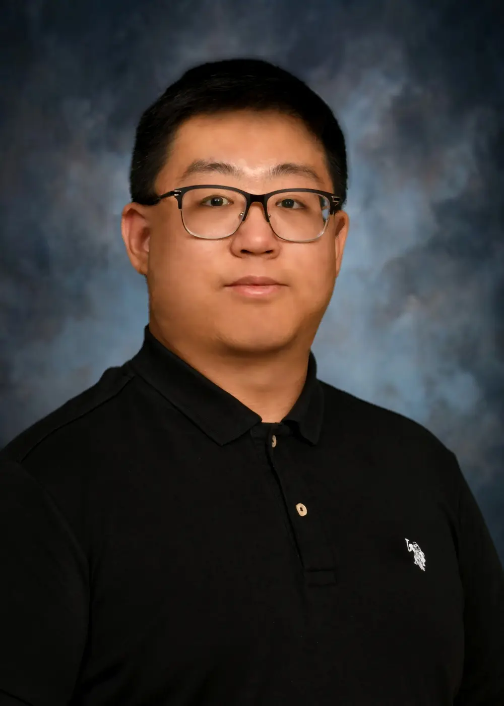

​I am an engineer who enjoys solving problems with programming and electronics.

#### Electrical, Electronics and Computer Engineering

- [Bachelor of Science](diploma_bs.pdf.pdf) (August 2016 - May 2021),
  [University of Cincinnati](https://www.uc.edu/), USA
- [Master of Science](diploma_ms.pdf) (August 2023 - December 2024), [Bradley
  University](https://www.bradley.edu/), USA

<iframe
  src="https://drive.google.com/viewerng/viewer?embedded=true&url=https://github.com/liu2g/resume/releases/latest/download/eece_resume.pdf"
  width="100%" height="400"
  frameBorder="0" scrolling="auto"
>
</iframe>

---

# Softwares I use

- OS: Linux (currently Arch and Pop!_OS)
- Data Automation and Visualization: Python, Bash
- Software engineering: Git, VSCode, Vim, GCC, Qt, GTK
- Electronics Design & Simulation: KiCAD, MATLAB & Simulink, PySpice, Xilinx Vivado
- Robotics: ROS, Gazebo, CoppeliaSim
- Documentation: Markdown, LaTeX

<table>
  <tr>
    <td align="center"></td>
    <td align="center"></td>
    <td align="center">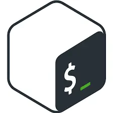</td>
    <td align="center">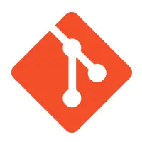</td>
    <td align="center"></td>
    <td align="center">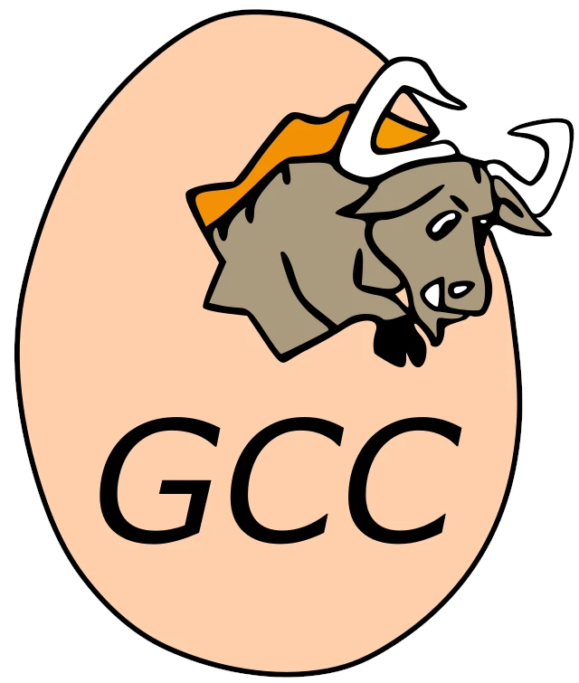</td>
   </tr>
   <tr>
    <td align="center">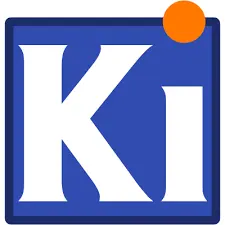</td>
    <td align="center">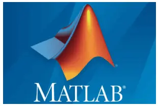</td>
    <td align="center">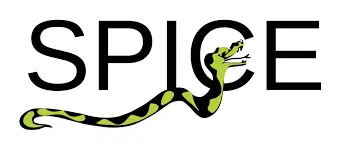</td>
    <td align="center">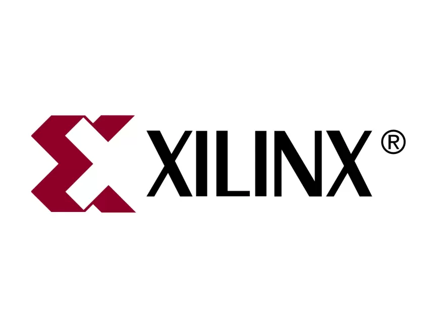</td>
    <td align="center">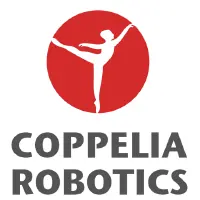</td>
    <td align="center">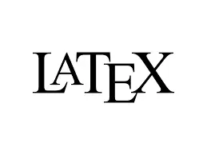</td>
  </tr>
</table>

---

# Academic Publications

- Z. Liu and M. S. Miah, “Cooperative Object Transportation Using Autonomous Networked Cobots: A Distributed Approach,” in *IEEE Intl. Symp. on Robotic and Sensors Environments*, Jun. 2024, pp. 1–7. doi: [10.1109/ROSE62198.2024.10590934](https://doi.org/10.1109/ROSE62198.2024.10590934).
- Z. Liu, “Decentralized coordination of networked cobots: a graph-theoretic approach to object transportation,” master, Bradley University, USA, 2024. Available [online](https://www.proquest.com/docview/3154701510).
- M. S. Miah, Z. Liu, C. Diercks, C. R. Davey, R. D. Jockisch and A. R. Cross, "Pulmonary Acoustic Sensor Telemetry Array: A Prototype for Remote Monitoring, Diagnosis, and Prognostication of Pulmonary Sounds," in *IEEE Access*, vol. 13, pp. 40594-40606, 2025, doi: [10.1109/ACCESS.2025.3546967](https://doi.org/10.1109/ACCESS.2025.3546967).
- Z. Liu and M. S. Miah, “Decentralized Multi-Cobot Navigation Under Intermittent Communication,” Robotics, vol. 15, no. 1, p. 4, Jan. 2026, doi: [10.3390/robotics15010004](https://doi.org/10.3390/robotics15010004).

---

# Professional Experience

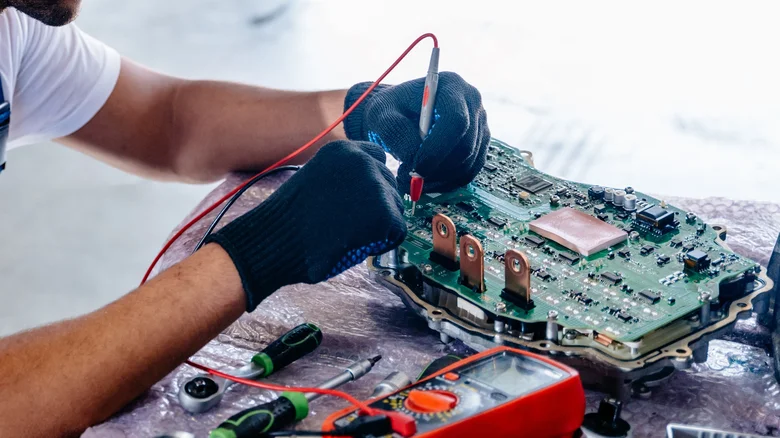

#### Core Machine Platform Software Developer (Summer 2024)
- Developed and maintained automated software-in-the-loop (SIL) simulation and testing tool for Caterpillar embedded software by extending Google Test framework with C/C++
  - Benchmarked and optimized software performance for better test efficiency
  - Added quality of life features to the software
  - Enriched and clarified tool documentation
- Developed and maintained user interactive SIL tool as GUI application with Python and wx framework
  - Collaborated with embedded developers and testers to troubleshoot bugs
  - Added feature as per user requests
  - Refactored code base to conform with coding standards

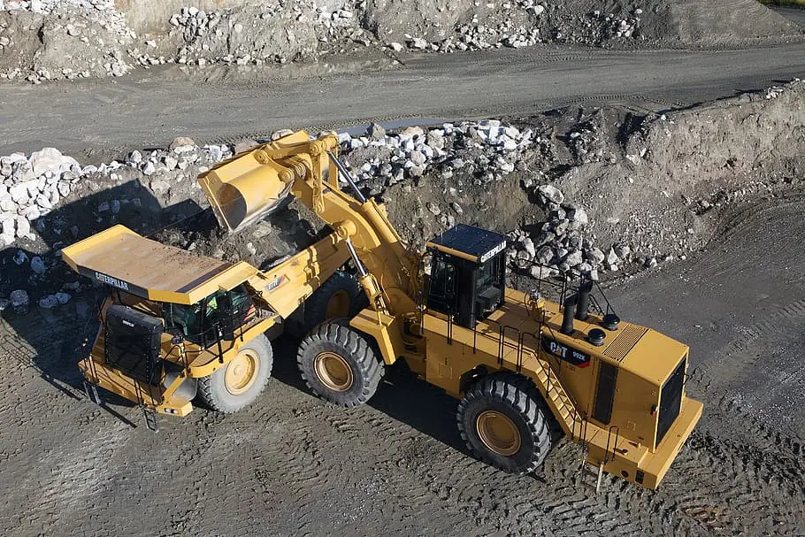

#### Vehicle Embedded Software Engineer & Tester (Fall 2021 - Summer 2023)

- Maintain and troubleshoot embedded C firmware for Electronic Control Module
 (ECM) on Catepillar construction vehicles
- Maintain and develop automated testing framework for ECM firmware in a virtual
  simulated environment
- Develop feature-oriented test strategies and automation scripts for ECM firmware

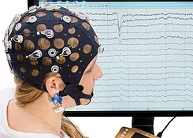

##### Brain Computer Interface Research Lab at UC (Fall 2019 - Summer 2021)

- BCI Lab at UC, Dr. Anca Ralescu as research advisor
- Project Brief: Using electroencephalogram (EEG) instruments, find patterns in
  brain signals in people with/without cerebral palsy

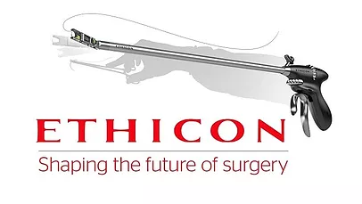
    
  
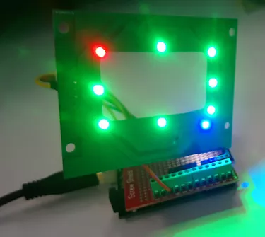
    
  
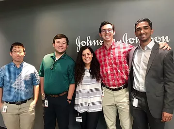

##### R&D Electrical Engineer Co-op at Ethicon (Summer 2019)

**Ethicon Endo Surgery Devices** in Blue Ash, Cincinnati, Ohio. Ethicon belongs
to Johnson & Johnson family and they design various kinds of medical surgery
devices.

​**Project 1 Brief**

- LED PCB for a prototype unit
- I went through chematic drawing, part selections, PCB layout, design reviews,
  board assembly and testing
- Used microcontroller to send serial data into the registers on the chips, while
  using other troubleshooting methods to test the capability of the board

**Project 2 Brief**

- Test fixture of a prototype NFC board designed by another Co-op
- Reverse-engineered a demonstration board that uses the same NFC reading chip as
  the board to construct the test fixture
- Through datasheets, schematics and testing, I managed to by-pass the
  unnecessary components on the demo board, and drive our prototype NFC without
  compromise

**Technical Development**: This was my first time building prototype PCB, so I
learned a lot from the design to testing.

**Non-Technical Development**: I networked with a lot of EE at my team, who gave
me suggestions on choosing EE careers and developing communication skils. Their
advice, together with my experience so far, had given me some different future
choices that I would like to consider.

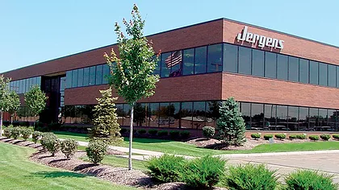
    
    
  
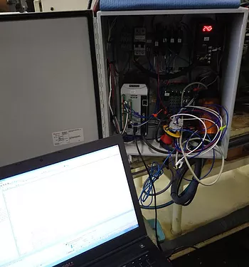

##### Auto-Assembly Engineer Co-op at Jergens, Inc.,  (Spring-Summer 2018)

**Jergens, Inc.** is a manufacturing corporation that assembles mechanical parts
such as lock pins, hoist rings as well as hardware fixtures.

**Responsibilities**
- Supervising daily job operations on an laser engraving machine and full-auto
  assembly machine
- Project manager on a safety system add-on to a grinder machine

**Project Brief**: Using B&R Automation System (or commonly known as PLC), the
system prevented large part from feeding into the machine, thus ensured the
safety of operators and avoided damage on the grinding wheel

**Technical Development**: I used my programming skills on the implementation of
the system and HMI.

**Non-Technical Development**: I adopted tools to improve my task management
skills so that I can handle both daily machine supervision and project management.

Over this Co-op, I have experienced the industrial application of electrical
engineering. I was glad to learn that programming skills are more needed for
automatic assembly engineers. I also found myself to be a project-orientated
person. These all helped me to set up my expectations on my next Co-op.

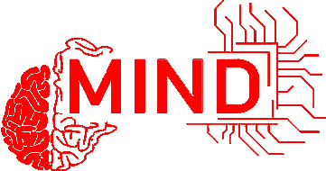

##### UC MIND Lab for Protege Program  (Summer 2017)

- **MIND Lab at UC** with Dr. Rashmi Jha as research advisor
- **Research Topic**: Application of neuromorphic computing
- **Project brief**: Built a test fixture that translates an binary signal to an
  electrical signal close to neuron communications
- **Technical Development**: Lab electronics instrumentation skills including
  using oscilloscope, soldering, etc.
- **Non-technical Development**: Wrote my first technical document and manual on
  a system I engineered