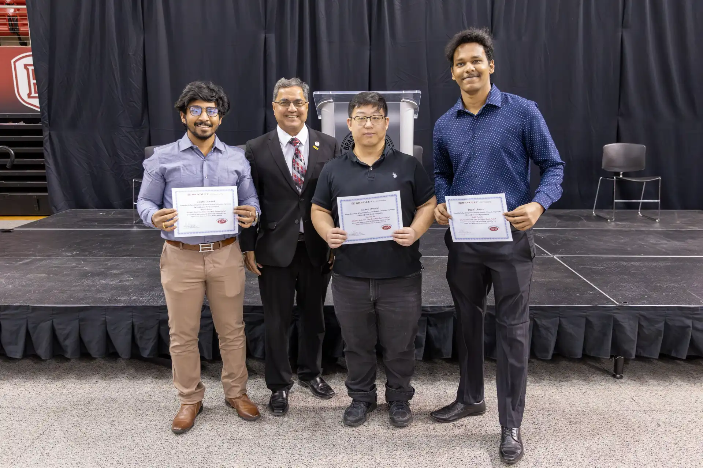

In this industrial research project sponsored by [Caterpillar, Inc](https://www.caterpillar.com/), we investigate a prevalent issue within the rapidly growing field of teleoperation technology.

The problem arises when live video feeds, transmitted over unpredictable wireless networks, compromise the robustness of remote control due to packet loss, buffering, and latency.
To address these challenges, we explore a range of technologies, including compression, transmission protocols, super-resolution, and load balancing.
Following our research, we incorporate our findings into a comprehensive system for empirical validation.

<iframe
  src="poster.pdf"
  type="application/pdf"
  width="100%"
  height="650"
  frameborder="0"
  allowfullscreen
>
</iframe>

<a href="poster.pdf">Download Poster</a>

Our work and poster was presented at the [Bradley Student Scholarship Expo](https://www.bradley.edu/sites/expo/) and won ECE Graduate Studies Award.

