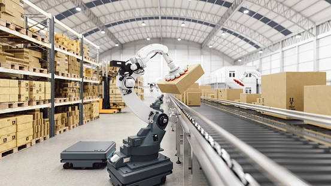
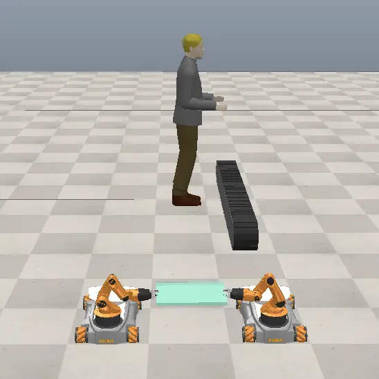
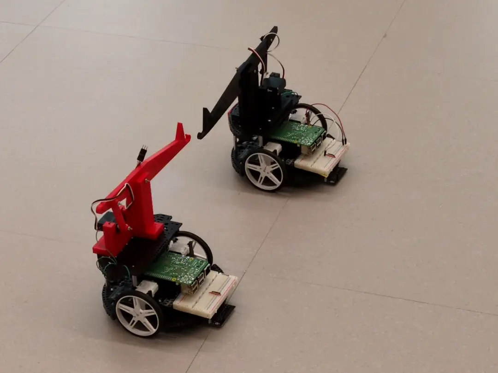
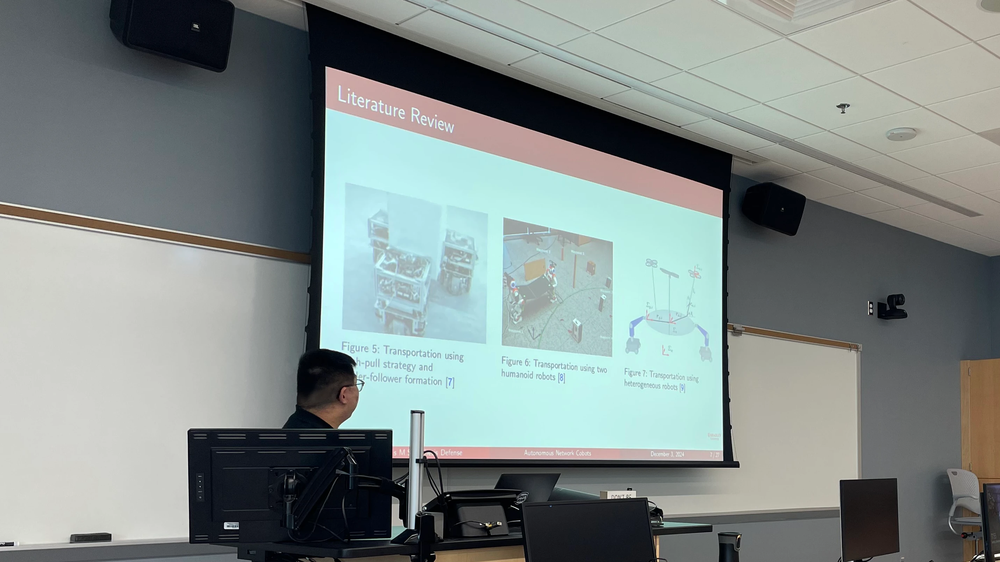

This article briefly iterates the story behind my thesis research, which completes my Master's of Science degree at Bradley University.

The research started around November 2024, after I talked to a few professors at the ECE department about ideas for the thesis research.
Dr. Miah's proposal on robotics sounded particularly interesting to me, since I have always been curious about academic studies on robotics.
One of my goals for the research was also to publish some paper, and Dr. Miah also happens to be active on and good at.
Initially, we selected cobots, short for collaborative robots as the topic of the research.
We wanted to use robot manipulator mounted on mobile platforms like in Fig. 1, but we were not sure about specific goals or problems we wanted to solve.
As a result, I started a literature review about challenges and opportunities for cobots.
In the review, I studied popular control techniques for robot manipulators, and surveyed state-of-the-art methods for robot navigation.
I also looked into multi-robot system studies, in case we scale our research into multiple robots.
This literature review has been documented into a survey paper, and it's undergoing revision to be published at IEEE journal.

<figure>
  
  <figcaption> <small> Fig. 1: Example mobile manipulator </small> </figcaption>
</figure>

The next step in the research is computer simulation, which started around January 2025.
From the comprehensive literature review, we found a multi-robot system deployed for industrial object transportation tasks particularly interesting, so we decided to build a simulation scenario based on that idea.
We chose CoppeliaSim, a robot simulation software that has built-in physics engines to imitate the real-life scenario closely.
We used two KUKA Youbots to complete the task, since they are popular mobile manipulator widely used in research, and their model was available in the software.
The scenario set in simulation is illustrated in Fig. 2.
The detail about this simulation can be found in [my other article](@/cobots-sim/index.md) and the [IEEE ROSE conference paper](https://ieeexplore.ieee.org/document/10590934).

<figure>
  
  <figcaption> <small> Fig. 2: Computer Simulation </small> </figcaption>
</figure>

After the simulation was completed, polished and demonstrated, we moved on to implement the envisioned robotic system around July 2025.
We were limited by budget to get KUKA Youbots, but we leveraged parts used by Dr. Miah and Dr. Henderson from the Mechanical Engineering department for the Bradley University - Detroit Area Pre-College Engineering Program (BU/DAPCEP).
The parts allowed me to assemble differential drive robots (Romi robots) with servo-driven levers on them.
I also found two critical problems worth studying.
The first problem is the navigation of the differential drive robots in order to keep an object securely transported in the middle.
The movement of the differential drive robots are more complex to manage to achieve such goal compared to Mcanum wheeled robots.
For this, I introduced a third robot and designed special navigation scheduling methods.
Another problem is the resiliency of the robot network, *i.e.*, how far the system can maintain under an unstable network condition.
We formalized these two issues as research problems, and are currently writing a journal paper to document our methods.

<figure>
  
  <figcaption> <small> Fig. 3: Robots used in implementation </small> </figcaption>
</figure>

Lastly, around October 2025, I started preparing the thesis that incorporates the technical details of everything above.
I received great comments from Dr. Malinowski and Dr. Henderson, who are the thesis committee, and the defense went very well.
You can watch the thesis defense recording [here](https://youtu.be/Jgu7624eklM) and read the full-text thesis document [here](https://github.com/liu2g/school-files/tree/main/fall2024-thesis).

<figure>
  
  <figcaption> <small> Fig. 3(a): Thesis defense </small> </figcaption>
</figure>

<figure>
  
  <figcaption> <small> Fig. 3(b): Thesis defense </small> </figcaption>
</figure>

Over the entire research, I studied, understood and applied fundamental robotics theories such as kinematic analysis, manipulator control, navigation methods, etc.
Having a few papers published and thesis completed, I have gained more experience and skills in writing academic papers.
Though I still have a lot to learn in the field of robotics, looking back the whole experience, I ultimately enjoyed the part where I sat down and wrote code the most, which somewhat aligned with my initial feeling before starting graduate school.
On the other hand, among all the applications I have programmed for, robotics was possibly one of the most interesting one, since the code has a direct, obvious impact on the application.
In the far future, if I decided to pursue for PhD, I might study cybersecurity in robotics or cyberphysical systems in particular, because it sounds like an area where I can do more programming that has more impactful consequences.
